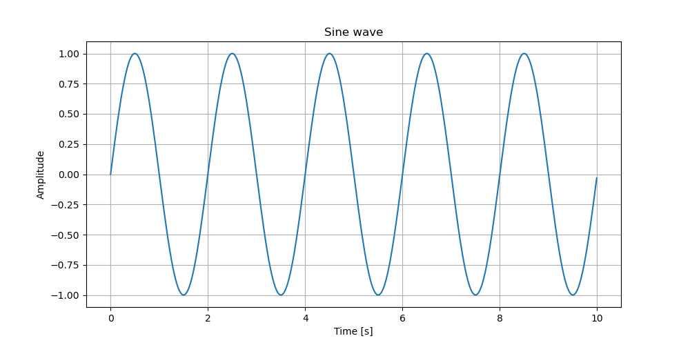
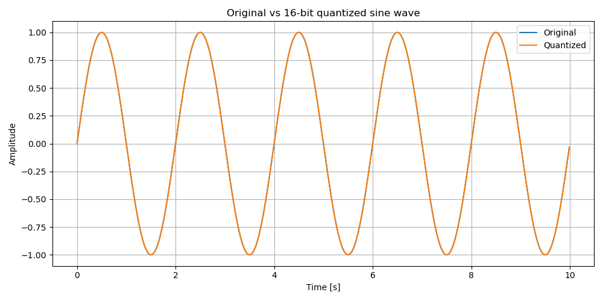
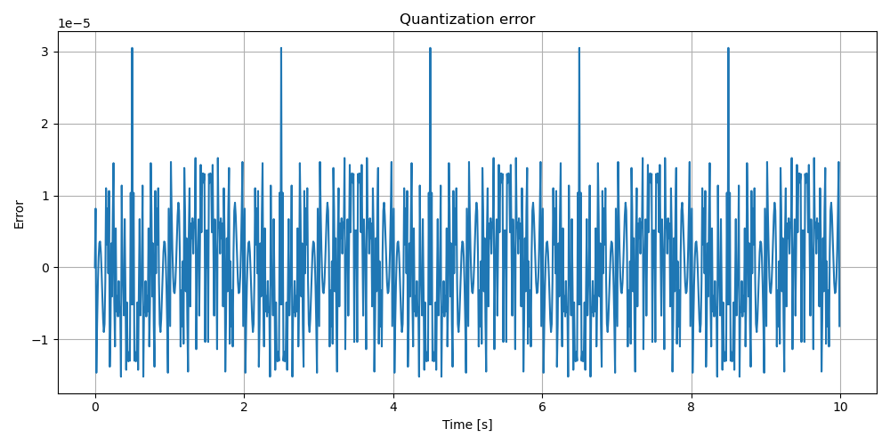
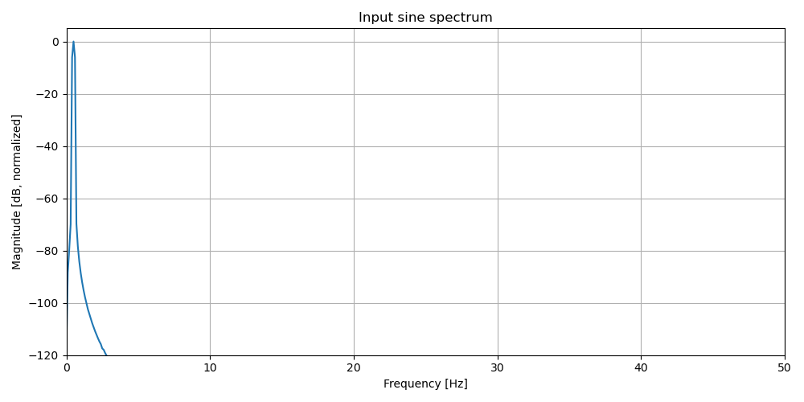
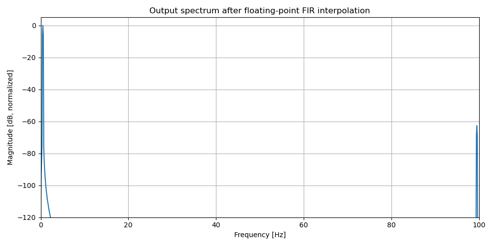
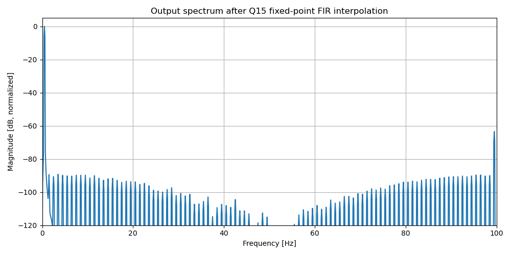
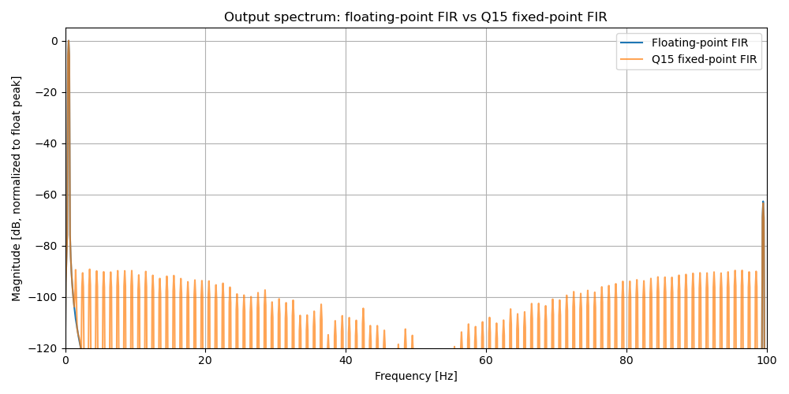

# Тестовое задание YADRO «Импульс»: квантование и интерполяция синусоидального сигнала

## Краткое описание

В репозитории представлено решение тестового задания по цифровой обработке сигналов.

Основная реализация выполнена на **C++17** в файле `main.cpp`.
Все численные результаты сохраняются в папку `results/`. Python-скрипты также лежат в `results/` и используются только для построения графиков и спектрального анализа по CSV-файлам, которые создаёт C++ программа.

Реализованы все пункты задания:

1. Генерация синусоидального сигнала с частотой `f = 0.50 Гц` при фиксированной частоте дискретизации `Fs = 100 Гц` в формате плавающей точки.
2. Квантование синуса к 16-битной сетке в коде и анализ ошибки квантования.
3. Интерполяция сигнала в плавающей точке с повышением частоты дискретизации в 2 раза.
4. Анализ качества интерполяции в зависимости от частоты входного синуса.
5. Интерполяция квантованного сигнала в формате с фиксированной точкой и сравнение с реализацией в плавающей точке.

---

## Структура репозитория

```text
.
├── .gitignore                  # исключает бинарныЙ файл
├── README.md                   # описание решения, запуска, структуры результатов и выводов
├── main.cpp                    # основная реализация задания на C++17
│
└── results/                    # папка со всеми результатами и Python-скриптами для графиков
    ├── plot.py                 # строит график исходного синуса из sin.csv
    ├── plot_quant.py           # строит график квантованного сигнала и график ошибки квантования
    ├── plot_spectrum.py        # строит спектры входного и выходных сигналов через FFT
    │
    ├── sin.csv                 # исходный синус: время t и значение x(t)
    ├── quantized.csv           # исходный сигнал, Q15-код, восстановленное значение и ошибка квантования
    ├── interpolated_fir.csv    # результат плавающей точки FIR-интерполяции x2
    ├── interpolated_q15.csv    # результат Q15 FIR-интерполяции x2
    ├── interpolation_quality.csv
    │                           # таблица качества интерполяции по частотам: RMSE, max error, mean error, SNR
    ├── quantization_metrics.txt
    │                           # текстовый отчёт по ошибке квантования: max error, mean error, RMS, SNR
    │
    ├── sine_wave.png
    │                           # график исходного синуса 0.5 Гц при Fs = 100 Гц
    ├── sine_wave_q.png
    │                           # сравнение исходного синуса и восстановленного Q15-сигнала
    ├── quantization_error.png
    │                           # ошибка квантования во времени: original - restored
    ├── spectrum_input.png
    │                           # спектр исходного синуса; основной пик около 0.5 Гц
    ├── spectrum_interpolated_fir.png
    │                           # спектр после FIR-интерполяции
    ├── spectrum_interpolated_q15.png
    │                           # спектр после Q15 FIR-интерполяции
    └── spectrum_output_compare.png
                                # сравнение спектров FIR и Q15 FIR
```

---

## Сборка и запуск

### 1. Сборка C++ программы

```bash
g++ -std=c++17 main.cpp -o main
```

### 2. Запуск C++ программы

```bash
./main
```

После запуска C++ программа создаёт папку `results/`, если она отсутствует, и сохраняет туда:

```text
results/sin.csv
results/quantized.csv
results/quantization_metrics.txt
results/interpolated_fir.csv
results/interpolated_q15.csv
results/interpolation_quality.csv
```

### 3. Построение графиков

Python-скрипты лежат внутри `results/` и читают CSV-файлы из текущей директории, поэтому запускать их нужно из папки `results/`:

```bash
cd results

python3 plot.py
python3 plot_quant.py
python3 plot_spectrum.py

cd ..
```

После запуска Python-скриптов в `results/` создаются PNG-графики:

```text
results/sine_wave.png
results/sine_wave_q.png
results/quantization_error.png
results/spectrum_input.png
results/spectrum_interpolated_fir.png
results/spectrum_interpolated_q15.png
results/spectrum_output_compare.png
```

---

## Параметры эксперимента

| Параметр | Значение |
|---|---:|
| Частота исходного синуса `f` | `0.50 Гц` |
| Исходная частота дискретизации `Fs` | `100 Гц` |
| Частота после интерполяции `Fs2` | `200 Гц` |
| Коэффициент интерполяции | `2` |
| Длительность сигнала | `10 с` |
| Количество отсчётов исходного сигнала | `1000` |
| Количество отсчётов после интерполяции | `2000` |
| Разрядность квантования | `16 бит` |
| Формат с фиксированной точкой | `Q15` |
| Длина FIR-фильтра | `61 коэффициент` |
| Окно FIR-фильтра | `Хэмминга` |

---

## Соответствие пунктам задания

| Пункт задания | Реализация | Выходные файлы |
|---|---|---|
| 1. Генерация синуса | `make_sin()` | `results/sin.csv`, `results/sine_wave.png` |
| 2. 16-битное квантование и анализ ошибки | `quantize_q15()`, `analyze_quantization_error()` | `results/quantized.csv`, `results/quantization_metrics.txt`, `results/sine_wave_q.png`, `results/quantization_error.png` |
| 3. Интерполяция x2 в плавающей точке | `interpolate_fir_x2()` | `results/interpolated_fir.csv`, `results/spectrum_interpolated_fir.png` |
| 4. Анализ качества интерполяции от частоты `f` | `analyze_interpolation_quality_by_frequency()` | `results/interpolation_quality.csv`, спектры выходного сигнала |
| 5. Интерполяция Q15 с фиксированной точкой | `interpolate_fir_x2_q15()` | `results/interpolated_q15.csv`, `results/spectrum_interpolated_q15.png`, `results/spectrum_output_compare.png` |

---

## Пункт 1. Генерация синусоидального сигнала

Исходный сигнал генерируется по формуле:

```text
x[n] = sin(2 * pi * f * t)
t = n / Fs
```

В основном эксперименте используются:

```text
f  = 0.50 Гц
Fs = 100 Гц
```

Результат сохраняется в `results/sin.csv`.



График показывает исходный синусоидальный сигнал с частотой `0.5 Гц`. За `10 с` видно `5` полных периодов сигнала.

---

## Пункт 2. Квантование в 16-битную сетку

Квантование выполнено в signed Q15 формате. Используется масштаб:

```text
Q15_SCALE = 2^15 = 32768
```

Диапазон `int16_t`:

```text
-32768 ... 32767
```

Соответственно, дробный диапазон Q15:

```text
-1.0 ... 0.999969
```

Значение `+1.0` точно не представимо в signed Q15. Поэтому при квантовании используется saturation до `INT16_MAX`.

Ключевая часть алгоритма:

```cpp
int32_t q = static_cast<int32_t>(std::round(x * Q15_SCALE));
q = std::clamp(q, static_cast<int32_t>(INT16_MIN), static_cast<int32_t>(INT16_MAX));
quantized_signal[i] = static_cast<int16_t>(q);
```

### Метрики квантования

Результат из `results/quantization_metrics.txt`:

```text
Max absolute error: 3.05176e-05
Mean error: 1.52588e-07
RMS error: 8.36222e-06
SNR (dB): 98.5433
```

Для 16-битного квантования теоретическая оценка SNR для синусоидального сигнала:

```text
SNR ≈ 6.02 * N + 1.76 dB
```

При `N = 16`:

```text
SNR ≈ 6.02 * 16 + 1.76 = 98.08 dB
```

Измеренное значение `98.5433 dB` близко к теоретическому. Это подтверждает корректность реализации квантования.



График показывает, что исходный сигнал и восстановленный после Q15-квантования сигнал визуально почти совпадают.



График показывает ошибку `original - restored`. Периодические пики около `3.05e-05` возникают в моменты, когда синус достигает `+1.0`: это значение не представимо точно в Q15 и насыщается до `32767`.

---

## Пункт 3. Интерполяция x2 в плавающей точке

Интерполяция реализована стандартным DSP-подходом:

1. Между исходными отсчётами вставляются нули.
2. Полученный сигнал фильтруется низкочастотным FIR-фильтром.
3. Частота дискретизации повышается с `100 Гц` до `200 Гц`.

В коде это реализовано функцией:

```cpp
std::vector<double> interpolate_fir_x2(const std::vector<double>& signal)
```

FIR-фильтр строится через windowed-sinc метод:

```cpp
std::vector<double> design_fir_interpolator_x2(size_t num_coeffs)
```

Используется окно Хэмминга и `61` коэффициент фильтра.

Результат интерполяции сохраняется в:

```text
results/interpolated_fir.csv
```

---

## Пункт 4. Анализ качества интерполяции в зависимости от частоты

Качество интерполяции анализируется для набора частот:

```text
0.5, 1, 2, 5, 10, 20, 30, 40 Гц
```

Для каждой частоты выполняются следующие шаги:

1. Генерируется исходный синус при `Fs = 100 Гц`.
2. Выполняется FIR-интерполяция до `Fs2 = 200 Гц`.
3. Генерируется эталонный синус сразу при `Fs2 = 200 Гц`.
4. Интерполированный сигнал сравнивается с эталоном.
5. Дополнительно выполняется Q15 интерполяция и сравнение с тем же эталоном.

При расчёте метрик первые и последние `(FIR_NUM_COEFFS - 1) / 2` отсчётов исключаются, чтобы не учитывать краевые эффекты FIR-фильтра.

### Метрики интерполяции

| Частота, Гц | Float RMSE | Float SNR, dB | Q15 RMSE | Q15 SNR, dB |
|---:|---:|---:|---:|---:|
| 0.5 | 7.33e-04 | 59.70 | 6.90e-04 | 60.24 |
| 1.0 | 4.83e-04 | 63.32 | 4.48e-04 | 63.98 |
| 2.0 | 2.55e-04 | 68.84 | 2.69e-04 | 68.40 |
| 5.0 | 4.00e-06 | 105.45 | 1.30e-05 | 94.74 |
| 10.0 | 8.57e-04 | 58.33 | 8.33e-04 | 58.58 |
| 20.0 | 9.79e-04 | 57.17 | 9.86e-04 | 57.11 |
| 30.0 | 1.22e-03 | 55.26 | 1.18e-03 | 55.55 |
| 40.0 | 9.82e-04 | 57.15 | 9.86e-04 | 57.11 |

Основной вывод: качество интерполяции зависит от частоты входного сигнала. При росте частоты сигнал быстрее меняется между соседними отсчётами, поэтому задача восстановления промежуточных значений становится сложнее.

### Спектральный анализ

Спектр строится в `results/plot_spectrum.py` через `numpy.fft.rfft`. Графики показаны в нормированных dB: `0 dB` соответствует самой сильной спектральной компоненте, а отрицательные значения показывают компоненты меньшей амплитуды.



График показывает спектр исходного синуса. Основной пик расположен около `0.5 Гц`.



График показывает спектр после FIR-интерполяции. Основная компонента около `0.5 Гц` сохраняется, а высокочастотная зеркальная компонента около `99.5 Гц` подавлена FIR-фильтром.

---

## Пункт 5. Q15 интерполяция с фиксированной точкой

Для квантованного сигнала реализована функция:

```cpp
std::vector<int16_t> interpolate_fir_x2_q15(const std::vector<int16_t>& signal)
```

Она является аналогом интерполятора из пункта 3, но работает с целочисленным входом и арифметикой с фиксированной точкой.

### Представление данных

| Объект | Тип | Формат |
|---|---|---|
| Входной сигнал | `int16_t` | Q15 |
| Коэффициенты FIR | `int32_t` | Q15 |
| Произведение | `int64_t` | Q30 |
| Аккумулятор свёртки | `int64_t` | Q30 |
| Выходной сигнал | `int16_t` | Q15 |

`int64_t` используется для аккумулятора, чтобы избежать переполнения при суммировании произведений коэффициентов фильтра и отсчётов сигнала.

После накопления результат масштабируется обратно из Q30 в Q15, округляется и ограничивается диапазоном `int16_t`.

Результат сохраняется в:

```text
results/interpolated_q15.csv
```



График показывает спектр после Q15 FIR-интерполяции. Основной пик около `0.5 Гц` сохраняется. Дополнительные малые компоненты связаны с квантованием входного сигнала и коэффициентов фильтра.



График сравнивает спектры FIR и Q15 FIR реализаций. Основные спектральные компоненты совпадают, что показывает близость реализации с фиксированной точкой к варианту с плавающей точкой. У Q15-версии заметны дополнительные малые побочные компоненты из-за квантования.

---

## Итоговые выводы

1. Синусоидальный сигнал `0.5 Гц` при `Fs = 100 Гц` успешно сгенерирован.
2. Q15-квантование выполнено корректно: измеренное SNR `98.5433 dB` близко к теоретическому значению для 16-битного квантования.
3. FIR-интерполяция с плавающей точкой повышает частоту дискретизации в 2 раза и сохраняет форму исходного синуса.
4. Качество интерполяции зависит от частоты входного сигнала.
5. Q15-интерполяция с фиксированной точкой даёт результаты, близкие к реализации с плавающей точкой, а отличия объясняются квантованием входного сигнала и коэффициентов фильтра.
6. Спектральный анализ подтверждает сохранение основной частоты сигнала после интерполяции.
